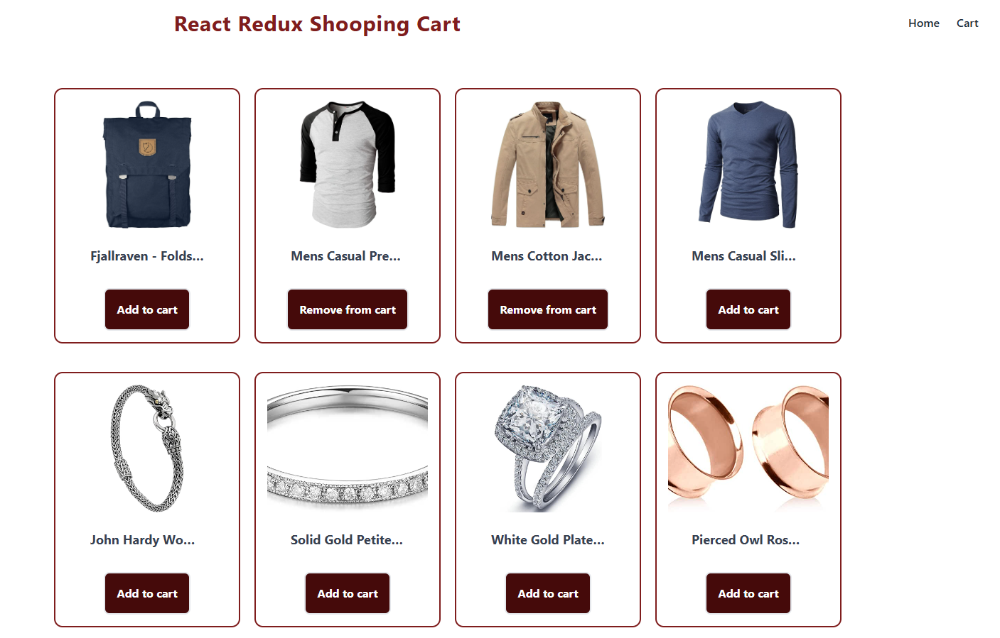

# React Shopping Cart (Refactored)



This project is a modern web-based shopping cart application built with **React**, **Redux Toolkit**, and **Tailwind CSS**. It demonstrates a scalable **Feature-Sliced Design (FSD)** architecture, focusing on separation of concerns, reusability, and clean code principles.

## 🚀 Features

-   **Dynamic Product Listing:** Displays products fetched from a remote API.
-   **Smart Cart Management:** "Add to Cart" functionality extracted as a standalone feature.
-   **Optimized Performance:** Uses Redux selectors for derived state (e.g., cart totals).
-   **Responsive UI:** Fully responsive design using Tailwind CSS.
-   **Clean Architecture:** strictly separated layers (App, Pages, Features, Entities, Shared).

## 🛠️ Architecture & Design Patterns

The project has been refactored to follow **Clean Architecture** principles:

### Key Improvements
-   **Decoupling Layers:** `ProductTile` (Entity) no longer depends on `Cart` logic. The "Add to Cart" action is now a separate feature (`features/cart/ui/AddToCartButton`) injected into the UI.
-   **Custom Hooks & Selectors:** Business logic (like calculating totals) is encapsulated in Redux Selectors (`selectCartTotal`) rather than inline component code.
-   **Side Effect Management:** Application title management moved to `useEffect` to avoid render-phase side effects.

### Directory Structure
```
src/
├── app/          # Global config, providers, and entry point
├── pages/        # Route components (Home, Cart) composing widgets/features
├── widgets/      # Composition of features and entities (e.g., Header)
├── features/     # User interactions (e.g., AddToCartButton)
├── entities/     # Domain data and UI (ProductTile, CartTile, Slices)
└── shared/       # Reusable primitives (hooks, ui-kit, utils)
```

## 💻 Installation & Setup

1.  **Clone the repository**:
    ```bash
    git clone https://github.com/slinkter/myprojectapi10.git
    cd myprojectapi10
    ```

2.  **Install dependencies** (using pnpm):
    ```bash
    pnpm install
    ```

3.  **Run locally**:
    ```bash
    pnpm run dev
    ```

4.  **Build for production**:
    ```bash
    pnpm run build
    ```

## 🎓 Case Study (For Software Engineering Students)

This repository serves as a **production-ready Case Study** for software engineering students, demonstrating advanced React patterns without the overhead of TypeScript. 

We have prepared a comprehensive guide explaining the **"Why"** behind every architectural decision:

👉 **[Read the Full Technical Case Study Here](./src/docs/case-study/README.md)**

Inside you will learn about:
1. **FSD Architecture:** Breaking the spaghetti-code cycle.
2. **State Management:** Thunks, API Abstraction, and strict Memoization.
3. **UI & Styling:** Tailwind composition with `cn()` and Layout Inversion.
4. **Clean Code:** Achieving TypeScript-like IntelliSense using pure JSDoc.