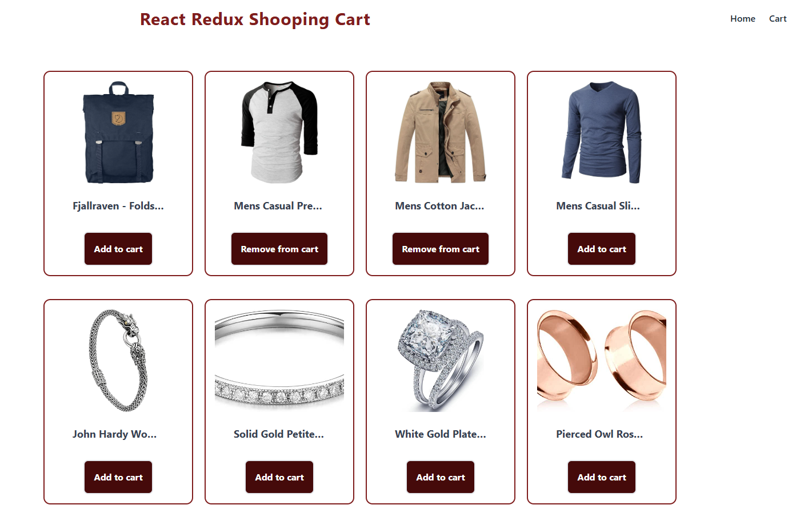

# Project API 10

-   se agrega [] en vite.config
    base: "https://slinkter.github.io/myprojectapi0x",
-   se instala paquete de github
    npm i --save-dev gh-pages
-   ir a package.json predeply y deploy

```javascript
"scripts": {
"dev": "vite",
"build": "vite build",
"lint": "eslint . --ext js,jsx --report-unused-disable-directives --max-warnings 0",
"preview": "vite preview",
"predeploy":"npm run build",
"deploy" : "gh-pages -d dist"
},

```

-   y ejecutar en terminal

npm run deploy

##



https://github.dev/sangammukherjee/shopping-cart-25-reactjs-interview-projects

https://fakestoreapi.com/

## ¿Qué es Redux?

Redux es una biblioteca de gestión de estado predecible para aplicaciones JavaScript. Imagina que es un almacén central donde se guarda toda la información que necesita tu aplicación (como el contenido de un carrito de compras, los datos de un usuario, etc.). Al cambiar esta información en un solo lugar, todos los componentes de tu aplicación se actualizan automáticamente.

### ¿Por qué usar Redux?

-   **Gestión de estado compleja:** Cuando tu aplicación crece y tiene mucho estado que gestionar, Redux te ayuda a mantenerlo organizado y evitar problemas de sincronización.
-   **Aplicaciones grandes y escalables:** Redux es ideal para aplicaciones grandes donde múltiples componentes necesitan acceder y modificar el mismo estado.
-   **Comunidad y herramientas:** Redux tiene una gran comunidad y muchas herramientas que facilitan su uso.

### Conceptos clave:

-   **Store:** El almacén central donde se guarda todo el estado de la aplicación.Almacena la lista de productos en el carrito.
-   **Actions:** Objetos que describen un cambio que se quiere hacer en el estado.Representan las acciones que pueden realizarse (agregar, eliminar).
-   **Reducers:** Funciones puras que toman el estado actual y una acción y devuelven un nuevo estado. Actualizan el estado del store en respuesta a las acciones.
-   **Dispatch:** Función que se utiliza para enviar una acción al store.
-   **State:** La representación actual de la aplicación en un momento dado.
-   **Provider:** Componente de React Redux que conecta tu aplicación al store.

### ¿Es lo mismo que useReducer y useContext?

No exactamente. Aunque tanto Redux como useReducer y useContext se utilizan para gestionar el estado en React, tienen diferentes enfoques:

-   **useReducer:** Es un hook de React que te permite gestionar el estado local de un componente. Es ideal para estados simples y componentes aislados.
-   **useContext:** También es un hook de React, pero te permite compartir estado entre componentes que están en diferentes niveles de la jerarquía del componente. Es útil para compartir datos globales, como el tema o la configuración del usuario.
-   **Redux:** Es una biblioteca externa que proporciona una solución más estructurada y escalable para gestionar el estado en aplicaciones grandes. Es ideal para aplicaciones con mucho estado y múltiples componentes que necesitan acceder a él.
