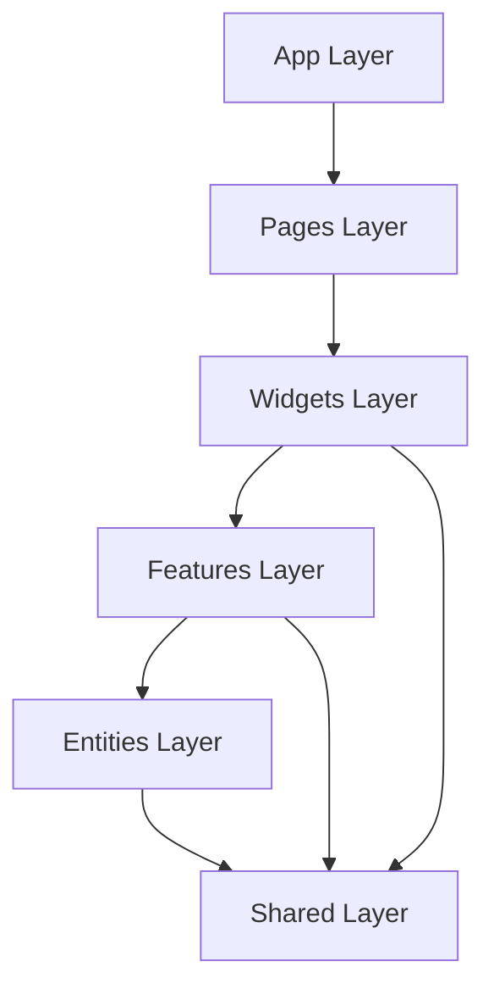

# Arquitectura de Software (Software Architecture)

## 1. Visión General
El proyecto utiliza una arquitectura basada en **Feature-Sliced Design (FSD)**, adaptada para aplicaciones React modernas. El objetivo principal es la **Baja Acoplación y Alta Cohesión**, facilitando la escalabilidad y el mantenimiento a largo plazo.

## 2. Diagrama de Capas (Layers)
La estructura de directorios refleja directamente las capas arquitectónicas. La regla de oro es: **Una capa solo puede importar de capas inferiores, nunca superiores.**

### Descripción de Capas

| Capa | Directorio | Responsabilidad |
| :--- | :--- | :--- |
| **App** | `src/app` | Configuración global. Entry point, Providers (Redux, Router), Estilos globales. |
| **Pages** | `src/pages` | Composición de vistas. Routing. Une Widgets y Features para formar una pantalla completa. |
| **Widgets** | `src/widgets` | Bloques de UI grandes y autónomos (ej. Header, CartSummary). Combinan Features y Entities. |
| **Features** | `src/features` | Interacciones de usuario con valor de negocio (ej. AddToCartButton). Contienen lógica de "Acción". |
| **Entities** | `src/entities` | Modelos de negocio (ej. Product, CartItem). Solo visualización de datos. NO contienen lógica de negocio compleja. |
| **Shared** | `src/shared` | Código reutilizable y agnóstico al dominio. UI Kits, APIs, Utils, Constantes. |

## 3. Patrones de Diseño Aplicados

### A. Container / Presentation Pattern (Separación Lógica/Vista)
*   **Container (Smart):** Features y Widgets manejan la lógica (Redux, API calls).
*   **Presentation (Dumb):** Entities y Shared UI solo reciben props y renderizan.

### B. Custom Hooks & Selectors (Facade Pattern)
La lógica de estado compleja se encapsula en custom hooks o selectores de Redux (`selectCartTotal`), actuando como una fachada para que los componentes de UI no conozcan la estructura interna del store.

### C. Atomic Design (Adaptado)
En la capa `shared/ui`, los componentes siguen principios atómicos (Button, Input, Card) para máxima reutilización.

## 4. Tecnologías Principales
*   **React 18:** Biblioteca de UI.
*   **Redux Toolkit:** Gestión de estado global.
*   **Tailwind CSS:** Motor de estilos Utility-first.
*   **Vite:** Build tool y dev server.
